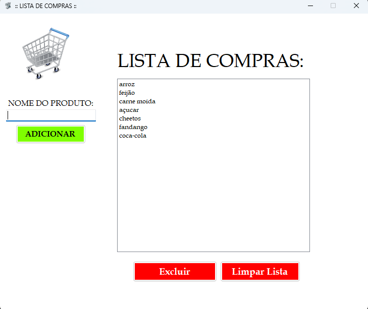

# ?? Gerenciador de Lista de Compras
 
Um aplicativo desktop simples e intuitivo desenvolvido em C# com Windows Forms para gerenciar suas listas de compras de forma prática e eficiente.
 
## ?? Sobre o Projeto
 
Este projeto é uma aplicação de desktop que permite aos usuários criar, editar e gerenciar suas listas de compras de maneira simples e organizada. O aplicativo oferece uma interface limpa e funcional para adicionar itens, visualizá-los em uma lista e removê-los conforme necessário.
 
## ?? Screenshot
 

 
*Interface principal do Gerenciador de Lista de Compras*
 
## ? Funcionalidades
 
- ? **Adicionar itens**: Insira novos produtos à sua lista de compras através de um campo de texto
- ?? **Visualizar lista**: Todos os itens adicionados são exibidos em um ListBox organizado
- ??? **Remover item único**: Selecione e exclua itens específicos da lista
- ?? **Limpar lista completa**: Apague todos os itens da lista com um único clique
- ?? **Interface intuitiva**: Design simples e focado na usabilidade
- ?? **Recursos de usabilidade**: Implementados para melhorar a experiência do usuário
 
## ??? Tecnologias Utilizadas
 
- **Linguagem**: C#
- **Framework**: .NET Framework / .NET
- **Interface**: Windows Forms
- **IDE**: Visual Studio
 
## ?? Pré-requisitos
 
Antes de executar o projeto, certifique-se de ter instalado:
 
- [.NET Framework 4.7.2+](https://dotnet.microsoft.com/download/dotnet-framework) ou [.NET 6.0+](https://dotnet.microsoft.com/download)
- [Visual Studio 2019+](https://visualstudio.microsoft.com/) ou [Visual Studio Code](https://code.visualstudio.com/)
 
## ?? Como Executar
 
1. **Clone o repositório**
   ```bash
   git clone https://github.com/seu-usuario/gerenciador-lista-compras.git
   ```
 
2. **Abra o projeto**
   - Abra o arquivo `.sln` no Visual Studio
   - Ou abra a pasta do projeto no Visual Studio Code
 
3. **Compile e execute**
   - No Visual Studio: Pressione `F5` ou clique em "Iniciar"
   - No terminal: Execute `dotnet run` na pasta do projeto
 
## ?? Como Usar
 
1. **Adicionar item**: Digite o nome do produto no campo de texto e pressione Enter ou clique no botão "Adicionar"
2. **Visualizar itens**: Todos os produtos adicionados aparecerão na lista principal
3. **Remover item específico**: Selecione um item na lista e clique em "Remover Item"
4. **Limpar lista**: Clique em "Limpar Tudo" para apagar todos os itens da lista
 
## ??? Estrutura do Projeto
 
```
?? GerenciadorListaCompras/
+-- ?? Properties/
+-- ?? Form1.cs              # Formulário principal
+-- ?? Form1.Designer.cs     # Designer do formulário
+-- ?? Form1.resx           # Recursos do formulário
+-- ?? Program.cs           # Ponto de entrada da aplicação
+-- ?? README.md            # Documentação do projeto
```
 
## ?? Interface do Usuário
 
A interface é composta por:
- **TextBox**: Campo para inserir novos itens
- **ListBox**: Exibe todos os itens da lista de compras
- **Botões**: Controles para adicionar, remover e limpar itens
- **Layout responsivo**: Interface adaptável e de fácil uso
 
## ?? Possíveis Melhorias Futuras
 
- [ ] Salvar listas em arquivo para persistência de dados
- [ ] Categorização de produtos
- [ ] Quantidade de itens
- [ ] Preços estimados
- [ ] Múltiplas listas de compras
- [ ] Exportar lista para diferentes formatos
- [ ] Tema escuro/claro
 
## ?? Contribuição
 
Contribuições são sempre bem-vindas! Para contribuir:
 
1. Faça um Fork do projeto
2. Crie uma branch para sua feature (`git checkout -b feature/AmazingFeature`)
3. Commit suas mudanças (`git commit -m 'Add some AmazingFeature'`)
4. Push para a branch (`git push origin feature/AmazingFeature`)
5. Abra um Pull Request
 
## ?? Licença
 
Este projeto está sob a licença MIT. Veja o arquivo [LICENSE](LICENSE) para mais detalhes.
 
## ????? Autor
 
**Guilherme vitor**
- GitHub: https://github.com/guihmk3/
 
## ?? Agradecimentos
 
- Obrigado por usar este projeto!
- Se você gostou, não esqueça de dar uma ? no repositório!
 
---
 
*Desenvolvido usando C# e Windows Forms*